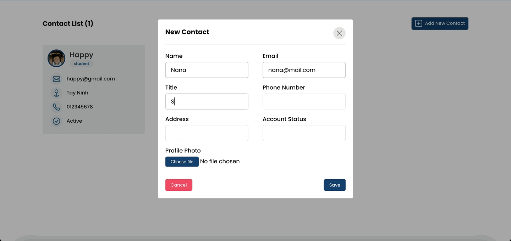

# Tomato Garden

## General info

A simple web contact book written in Java + Spring (backend) and React (frontend).



## Table of contents

- [General info](#general-info)
- [Technologies](#technologies)
- [Setup](#setup)
- [Features](#features)

## Technologies

Project is created with:

- Java
- Spring Boot
- JavaScript
- React
- MySQL

## Setup

In order to run project locally you need to clone this repository and build project with backend and frontend:

```
$ git clone git@github.com:nanasintown/contactapi.git
$ cd contactapi/frontend
$ npm start
```

For Backend, open backend profile and run the application (Java 21)

Make sure to have your database setup!

## Features

- [x] Contact
  - [x] GUI
  - [x] Adding
  - [x] Deleting
  - [x] Update photo
